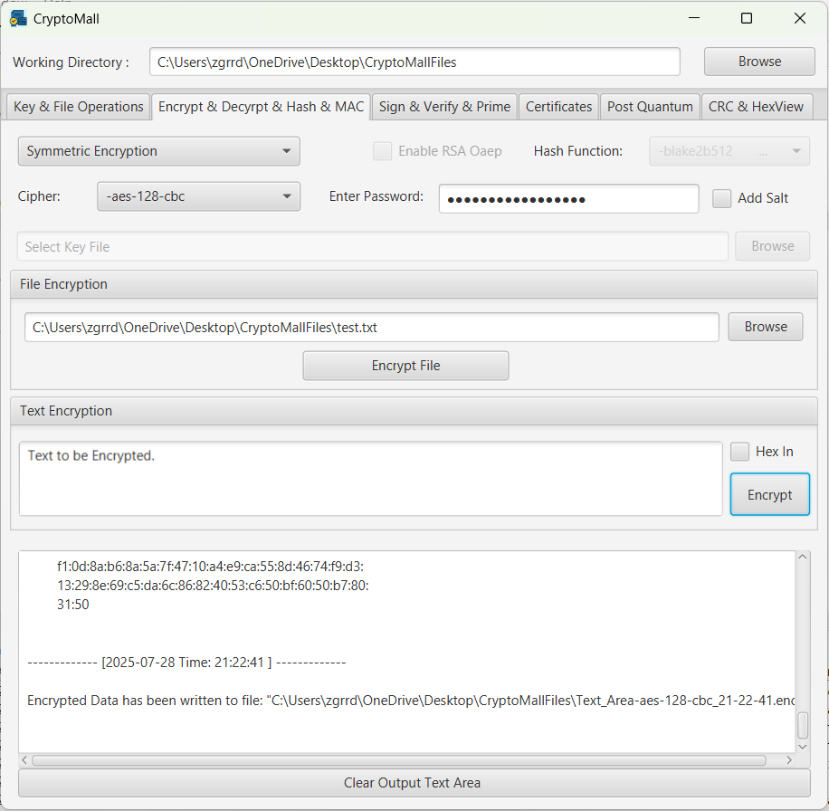
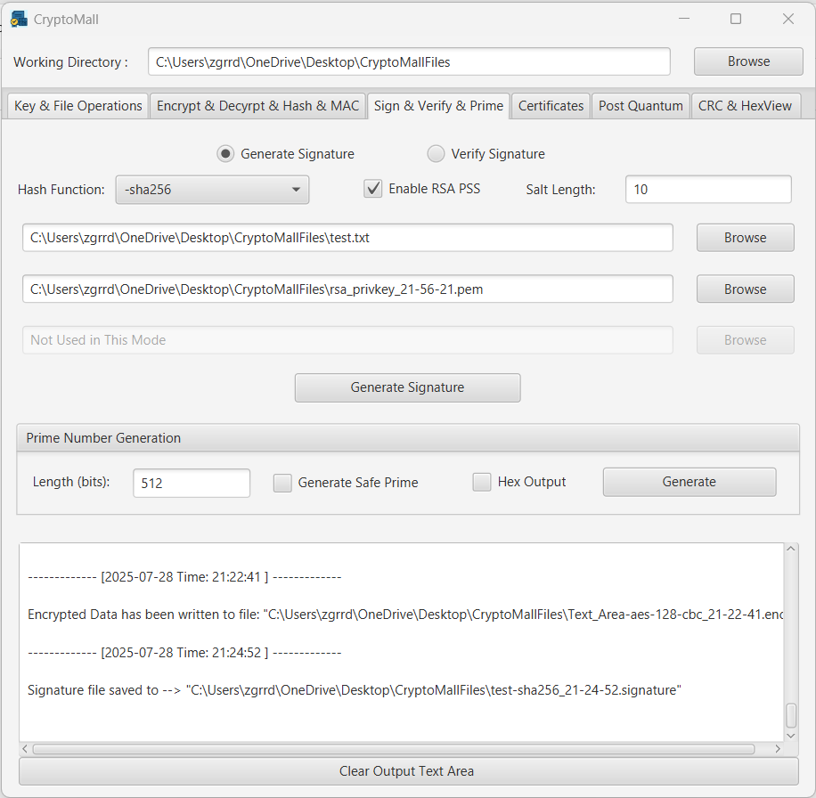
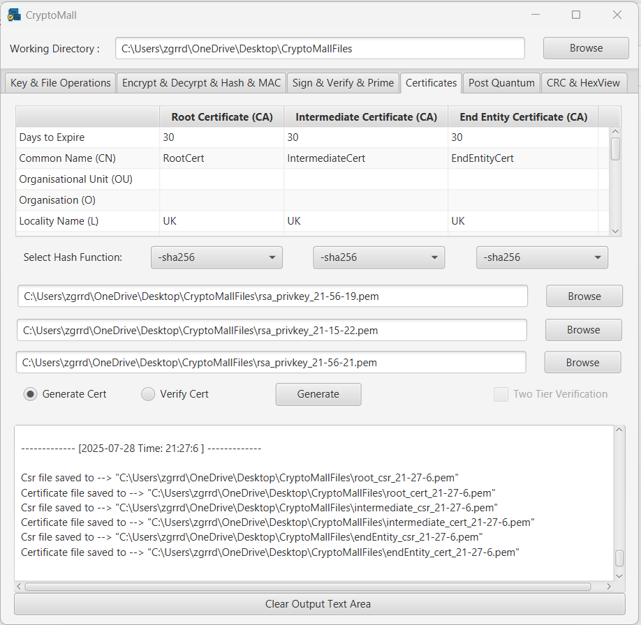
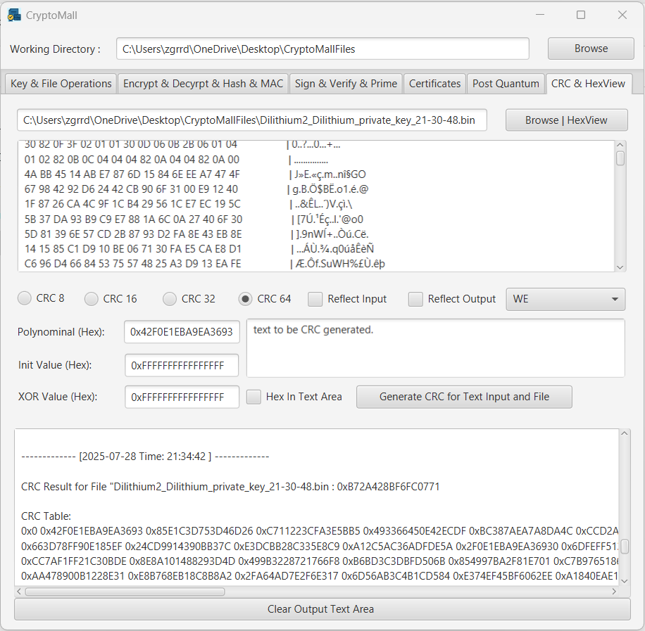

<a id="readme-top"></a>

<br />
<div align="center">
  <a href="https://github.com/Telefu21/cryptomall">
    
  </a>

  <h3 align="center">CryptoMall</h3>

  <p align="center">
    Classic and Post Quantum Cryptography Calculation Tool
    <br />
    <a href="https://github.com/Telefu21/cryptomall/issues/new?labels=bug&template=bug-report---.md">Report Bug</a>
    &middot;
    <a href="https://github.com/Telefu21/cryptomall/issues/new?labels=enhancement&template=feature-request---.md">Request Feature</a>
  </p>
</div>


<!-- TABLE OF CONTENTS -->
<details>
  <summary>Table of Contents</summary>
  <ol>
    <li>
      <a href="#about-the-project">About The Project</a>
      <ul>
        <li><a href="#built-with">Built With</a></li>
      </ul>
    </li>
    <li>
      <a href="#getting-started">Getting Started</a>
      <ul>
        <li><a href="#prerequisites">Prerequisites</a></li>
        <li><a href="#installation">Installation</a></li>
      </ul>
    </li>
    <li><a href="#usage">Usage</a></li>
    <li><a href="#roadmap">Roadmap</a></li>
    <li><a href="#contributing">Contributing</a></li>
    <li><a href="#license">License</a></li>
    <li><a href="#contact">Contact</a></li>
    <li><a href="#acknowledgments">Acknowledgments</a></li>
  </ol>
</details>


<!-- ABOUT THE PROJECT -->
## About The Project
</p>

CryptoMall is a comprehensive cryptographic calculator built as a Java-based UI and RESTful application. It streamlines core crypto operations through a user-friendly interface and API endpoints.

## Features

🔑 Generate public/private key pairs (RSA, EC, DSA, DH etc.)

📜 Generate and verify digital signatures

🛡️ Encrypt and decrypt data (symmetric & asymmetric)

🔁 Perform hashing operations (SHA-256, MD5, etc.)

🔏 Compute CMAC/HMAC for message authentication

📊 Generate CRC checksums for integrity verification

🔄 Support file format conversion (e.g., PEM ↔ DER, View Certificates, View Key Files etc.)

📁 Manage and validate X.509 certificates

🧠 Explore Post-Quantum Cryptography

&nbsp; &nbsp;&nbsp;&nbsp;Selected Algorithms: Public-key Encryption and Key-establishment
* CRYSTALS-KYBER (3 parameter sets)
* HQC (3 parameter sets)

&nbsp; &nbsp;&nbsp;&nbsp;Selected Algorithms: Digital Signature
* CRYSTALS-DILITHIUM (3 parameter sets)
* FALCON (2 parameter sets)
* SPHINCS+ (24 parameter sets)

&nbsp; &nbsp;&nbsp;&nbsp;Round 4 Submissions: Public-key Encryption and Key-establishment
* BIKE (3 parameter sets)
* Classic McEliece (6 parameter sets)

🧪 Includes Postman-ready templates for easy API testing

Built with Spring Boot and JavaFx, CryptoMall is ideal for developers, researchers, and security enthusiasts seeking a modular and extensible cryptographic toolkit. It also includes Postman-ready templates to simplify endpoint testing.

Whether you're prototyping secure APIs, exploring post-quantum algorithms, or building your own crypto toolkit, CryptoMall offers a clean and extensible starting point.

<p align="right">(<a href="#readme-top">back to top</a>)</p>


### Built With

Cryptomall is built as a Maven project, with all dependencies listed in the  [pom.xml](https://github.com/Telefu21/cryptomall/blob/main/pom.xml) file. It integrates several key frameworks and libraries:

* **Spring Boot** – Powers the REST API backend.
* **JavaFX** – Provides the graphical user interface (GUI).
* **Bouncy Castle** – Implements Post-Quantum Cryptography.
* **OpenSSL** – Enables Classic Cryptography via system calls to the executable.
* **Log4j** – Handles application logging.

<p align="right">(<a href="#readme-top">back to top</a>)</p>

<!-- GETTING STARTED -->
## Getting Started

This is an example of how you may give instructions on setting up your project locally.
To get a local copy up and running follow these simple example steps.

### Prerequisites

This is an example of how to list things you need to use the software and how to install them.
* npm
  ```sh
  npm install npm@latest -g
  ```

### Installation

_Below is an example of how you can instruct your audience on installing and setting up your app. This template doesn't rely on any external dependencies or services._

1. Get a free API Key at [https://example.com](https://example.com)
2. Clone the repo
   ```sh
   git clone https://github.com/github_username/repo_name.git
   ```
3. Install NPM packages
   ```sh
   npm install
   ```
4. Enter your API in `config.js`
   ```js
   const API_KEY = 'ENTER YOUR API';
   ```
5. Change git remote url to avoid accidental pushes to base project
   ```sh
   git remote set-url origin github_username/repo_name
   git remote -v # confirm the changes
   ```

<p align="right">(<a href="#readme-top">back to top</a>)</p>


<!-- USAGE EXAMPLES -->
## Usage

Cryptomall features a user-friendly GUI that makes it easy to use, as demonstrated in the screenshots below. For API integration, please refer to the [Postman-ready templates](https://github.com/Telefu21/cryptomall/blob/main/api/CryptoMall.postman_collection.json).

<div align="center">
  <a href="https://github.com/Telefu21/cryptomall/blob/main/GUIScreenShots/KeygenFileConvertScreenShot.png">
    
  </a>
  <a href="https://github.com/Telefu21/cryptomall/blob/main/GUIScreenShots/EncryptDecryptScreenshot.png">
    
  </a>
  
  <a href="https://github.com/Telefu21/cryptomall/blob/main/GUIScreenShots/SignVerifyScreenShot.png">
    
  </a>
</div> 

<div align="center">
  <a href="https://github.com/Telefu21/cryptomall/blob/main/GUIScreenShots/CertificateScreenShot.png">
    
  </a>
  <a href="https://github.com/Telefu21/cryptomall/blob/main/GUIScreenShots/PostQuantumScreenShot.png">
    
  </a>
  <a href="https://github.com/Telefu21/cryptomall/blob/main/GUIScreenShots/CRCHexViewScreenShot.png">
    
  </a>
</div>

<p align="right">(<a href="#readme-top">back to top</a>)</p>


<!-- ROADMAP -->
## Roadmap

- [ ] Add CRC Calculation to API
- [ ] Add Encrypt/Decrypt functionality to API
- [ ] Add Changelog
- [ ] Add Additional Templates w/ Examples
- [ ] Add Api Documentation

See the [open issues](https://github.com/Telefu21/cryptomall/issues) for a full list of proposed features (and known issues).

<p align="right">(<a href="#readme-top">back to top</a>)</p>


<!-- CONTRIBUTING -->
## Contributing

Any contributions you make are **greatly appreciated**.

If you have a suggestion that would make this better, please fork the repo and create a pull request. You can also simply open an issue with the tag "enhancement".
Don't forget to give the project a star! Thanks again!

1. Fork the Project
2. Create your Feature Branch (`git checkout -b feature/SomeFeature`)
3. Commit your Changes (`git commit -m 'Add some Feature'`)
4. Push to the Branch (`git push origin feature/SomeFeature`)
5. Open a Pull Request

<!-- LICENSE -->
## License

CryptoMall is MIT Licensed. See [`LICENSE.txt`](./LICENSE) for more information.

<p align="right">(<a href="#readme-top">back to top</a>)</p>


<!-- CONTACT -->
## Contact

Ozgur Erdener: zgrrdnr@gmail.com

Project Link: [https://github.com/Telefu21/cryptomall](https://github.com/Telefu21/cryptomall)

<p align="right">(<a href="#readme-top">back to top</a>)</p>


<!-- ACKNOWLEDGMENTS -->
## Acknowledgments

* [Spring Boot](https://spring.io/projects/spring-boot)
* [JavaFx](https://openjfx.io/)
* [NIST Post Quntum Cryptography](https://csrc.nist.gov/projects/post-quantum-cryptography)
* [OpenSSL Documentation](https://docs.openssl.org/master/)
* [Maven Repository](https://mvnrepository.com/)
* [Bouncy Castle](https://www.bouncycastle.org/)
* [Postman](https://www.postman.com/)

<p align="right">(<a href="#readme-top">back to top</a>)</p>
